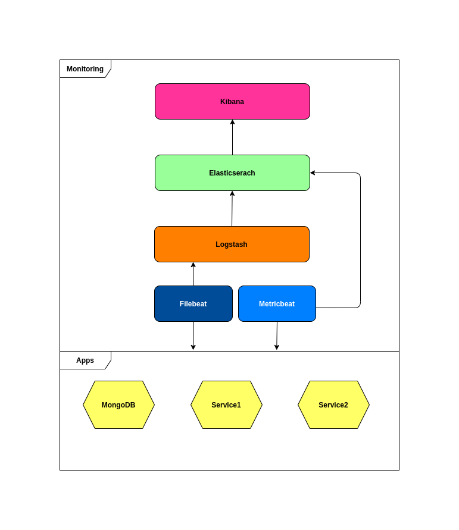

### Monitoramento ###

Monitoramento nada mais é do que a capacidade de medir o estado da app usando alguma ferramenta ou solução técnica para isso. Esse tema sempre foi de muito importante, porem na era da computação na nuvem e dos microserviços o monitoramento se tronou algo essencial, porque somente assim conseguimos depurar ativamente um sistema. 

O objetivo dessa POC foi montar a arquitetura da familia ELK, para responder algums perguntas:

- Dificuldade para montar arquitetura. 
    - Resposta: para os testes realizados foi muito simples usando o docker-compose
- Dificuldade de configuração 
    - Resposta: configurações tanto no logstash, quando nos beats é muito simples e com vasta documentação na elastic

    

### Arquitetura ###

### Dependências ###

- Docker
- Docker-Compose
- Java 11

### Referências ###

- [Elastic](https://www.elastic.co/pt/)
- [Wikipedia - definição de observabilidade](https://pt.wikipedia.org/wiki/Observabilidade)
- [Wikipedia - definição de Teoria_de_controle](https://pt.wikipedia.org/wiki/Teoria_de_controle)
- [Case da Uber de monitoramento e observabilidade](https://imasters.com.br/back-end/observabilidade-em-escala-construindo-o-ecossistema-de-alerta-da-uber)
- [Artigo da google sobre observabilidade e monitoramento](https://cloud.google.com/architecture/devops/devops-measurement-monitoring-and-observability?hl=pt-br)
- [Artigo sobre observabilidade e monitoramento](https://www.opservices.com.br/observabilidade/)
- [Artigo sobre observabilidade e monitoramento](https://www.motadata.com/pt/blog/observability-vs-monitoring/)
- [youtube - Definição sobre observabilidade](https://www.youtube.com/watch?v=ZYZKh-DZSs8)
- [youtube - Definição sobre observabilidade](https://www.youtube.com/watch?v=mgznPM8o9mU)
- [youtube - Definição sobre observabilidade](https://www.youtube.com/watch?v=NT7Ere9KgbY&t=2098s)